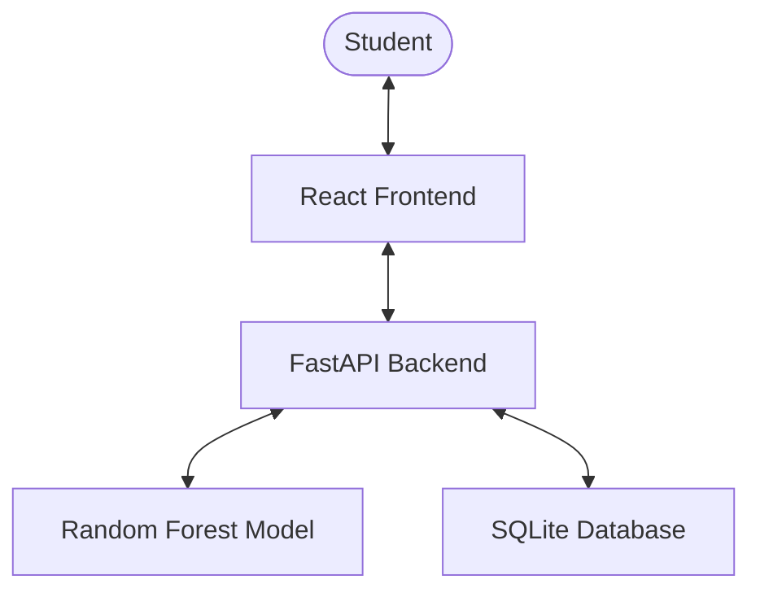
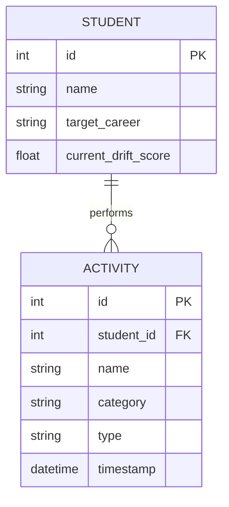
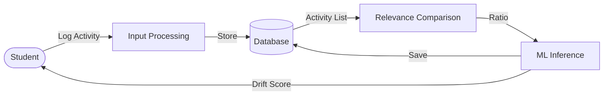

# Project Report: Career Drift Detection

## 1. Title
**Career Drift Detection: An AI-Powered Learning Path Alignment System**

---

## 2. Abstract
The "Career Drift Detection" system is designed to help students stay on track with their professional goals. In the modern learning environment, students often consume vast amounts of content across diverse platforms, making it easy to deviate from their target career path (e.g., a student aiming for "Data Science" spending excessive time on "Web Development"). This system leverages Machine Learning (Random Forest Classifier) to analyze student activities and calculate a "Drift Score." By monitoring the relevance of learning activities against a target career profile, the system provides early warnings and insights, ensuring students remain focused on the skills most critical for their professional success.

---

## 3. Architectural Design
The system follows a modern decoupled architecture:
- **Frontend**: Built with **React.js** for a dynamic and responsive user interface.
- **Backend**: **FastAPI (Python)** provides a high-performance RESTful API.
- **Database**: **SQLite** (managed via SQLModel) stores student profiles and activity logs.
- **ML Engine**: A **Random Forest Classifier** trained on career-specific skill sets to predict if a student's current path is "On Track" or "Drifting."



---

## 4. Entity-Relationship (ER) Diagram
The data model focuses on the relationship between students and their logged activities.



---

## 5. Data Flow Diagram (DFD) - Level 1
Shows how data move through the system from activity logging to drift prediction.



---

## 6. Use Case Diagram
Highlights the primary interactions between the student and the system.

```mermaid
usecaseDiagram
    actor Student
    package "Career Drift System" {
        usecase "Set Career Goal" as UC1
        usecase "Log Learning Activity" as UC2
        usecase "View Drift Analysis" as UC3
        usecase "Receive Alerts" as UC4
    }
    Student --> UC1
    Student --> UC2
    Student --> UC3
    Student --> UC4
```

---

## 7. Algorithms
The system utilizes the **Random Forest Classifier** algorithm.
1.  **Feature Extraction**: Calculates the `relevant_ratio` = (Count of activities matching target career skills) / (Total activities).
2.  **Classification**: The model is trained on historic datasets of "On Track" vs "Drifting" students.
3.  **Prediction**: Given a new student's activity ratio, the model predicts the probability of drift.
4.  **Action**: If $P(drift) > 0.5$, the system triggers a "Needs Attention" status.

---

## 8. Expected Outcome
- **Early Detection**: Students receive immediate feedback when their learning path diverges from their goals.
- **Data-Driven Insights**: Provides a quantitative "Drift Score" to measure focus levels.
- **Improved Focus**: Encourages students to prioritize high-impact learning activities.
- **Scalability**: The system can be expanded to include hundreds of career paths and automated course recommendations.
